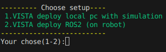
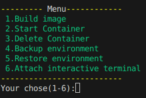
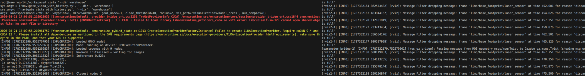
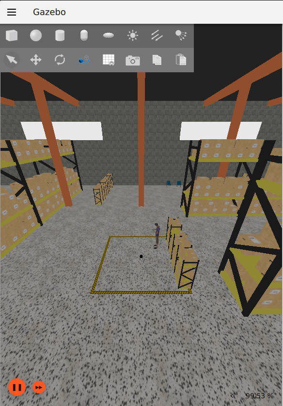
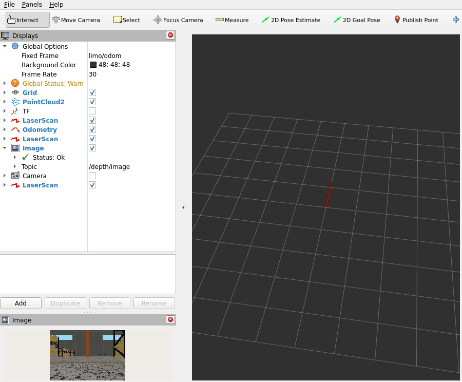
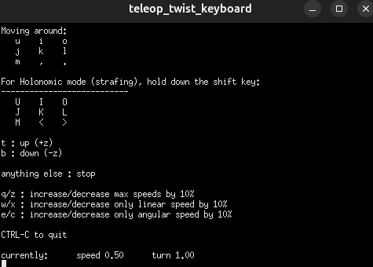
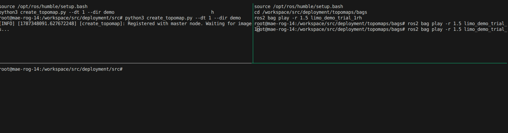
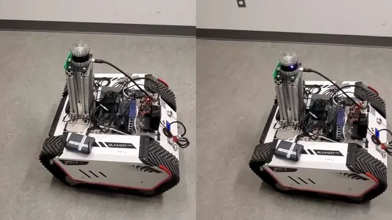
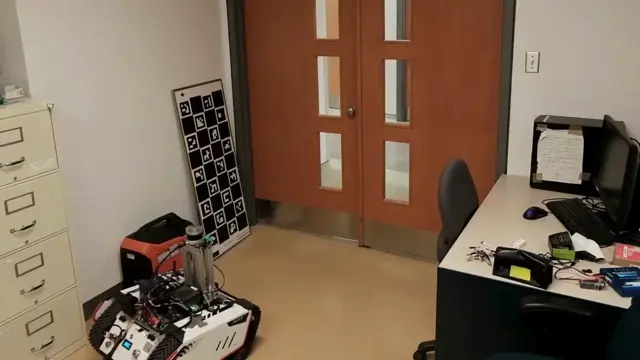
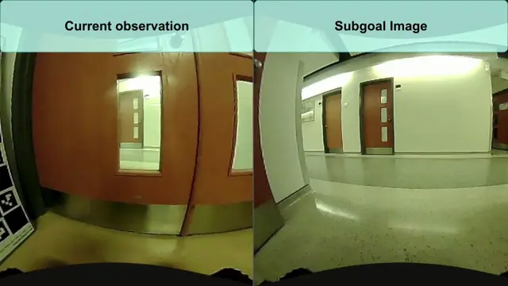

# VISTA: Scale-Aware Visual Navigation via Action History Conditioning

**[Maeva Guerrier](https://scholar.google.com/citations?hl=fr&user=4-GRCBsAAAAJ), Koki Kobayashi, [Simon Roy](https://scholar.google.ca/citations?user=Ltu98iQAAAAJ&hl=fr), [Jana Pavlasek](https://scholar.google.com/citations?hl=fr&user=yJS-u7IAAAAJ), [Giovanni Beltrame](https://scholar.google.com/citations?hl=fr&user=TVHJJ9wAAAAJ)**  


[](https://arxiv.org/abs/2606.17294)
[](https://maevaguerrier.github.io/papers-pages/)
[](WIP)
[](https://drive.google.com/drive/u/1/folders/1Ekql9bQT3sQxECGZI056F1ps3x9Jj3va)


[](LICENSE)


---


# Overview

<p align="center">
  
</p>


<details>
  <summary><strong><span style="font-size: 2.0em;">VISTA Architecture</span></strong></summary>
  &nbsp;

  <p align="center">
    
  </p>

</details>
&nbsp;

&nbsp;

# TODOs 📝

- Provide HF link
- Explain how to convert pth to onnx
- Provide website link
- Explain how to train
- Explain robot deployment
- Explain results showcase


&nbsp;

# Quickstart - 🐳 Dockers ready to go !

We provide two docker setups to run VISTA on your local computer with a working simulation and for your robot using NVIDIA Jetson ORIN (~see Troubleshooting for other setups).


## Guidelines

Download model weights (ONNX format, **VISTA.onnx**):

[](https://drive.google.com/drive/u/1/folders/1Ekql9bQT3sQxECGZI056F1ps3x9Jj3va)

Place the downloaded weights in ```src/deployment/model_weights```.

Run the script ```./docker_setup.sh```.

If you want to test VISTA on your local computer, use *option 1*; choose *option 2* to run VISTA onboard your robot!



<details>
  <summary><strong><span style="font-size: 1.5em;">VISTA deploy on local computer with simulation</span></strong></summary>
  &nbsp;

  Docker image build time: ~11 min.

  Upon choosing *option 1*, you will need to build the docker once, selecting *option 1* in the next menu. Once the docker is built (see the Troubleshooting section in case of build failure), re-run the script ```./docker_setup.sh```, this time using *option 1* followed by *option 2* to start the container. You can attach as many containers as you wish using *option 7* — to do so, repeat ```./docker_setup.sh```, using *option 1* followed by *option 7*.

  

  This setup will start by launching two [tmux](https://github.com/tmux/tmux/wiki/) terminals: the *right* terminal contains aliases to launch the navigation scripts, while the *left* terminal contains the gazebo simulation.

  

  To navigate the [tmux](https://github.com/tmux/tmux/wiki/) terminal, use ```ctrl+B``` then an arrow key. To scroll up and down, use ```ctrl+B+[```.

  The gazebo simulation consists of the displays below:

  
  
  

  The *left* picture displays the gazebo simulation, which you can explore by zooming in and out and moving around with your mouse. The *middle* picture corresponds to the rviz display, where you can view the camera stream. The *right* picture is the keyboard control, used to move the robot around. To control the robot, use the following keys:

  | Key | Effect |
  | --- | --- |
  | i | Forward |
  | j | Left |
  | l | Right |

  If you wish to stop the simulation, simply run ```ctrl+C``` in the *right* tmux terminal. To restart the simulation, simply type the word ```sim```.

  We have provided a pre-recorded topological map named ```warehouse```. To run VISTA with this topological map, simply type in the *left* tmux terminal: ```vista "--dir warehouse"```. (If you wish to record a new topological map, please see the Topological Maps section.)

  | Aliases | Purpose | Usage |
  | --- | --- | --- |
  | vista | Navigate with VISTA | ```vista "--dir {name_of_topological_map}"``` (for other possible arguments, see the Navigation Arguments section) |
  | nohist | Navigate with VISTA w/o AH | ```nohist "--dir {name_of_topological_map}"``` (for other possible arguments, see the Navigation Arguments section) |
  | bag | Record a ros2 bag named ```{robot}_{env}_trial_{trial}``` in ```src/deployment/topomaps/bags```, based on the topics given in ```topic_names.py``` | ```bag robot:={default:limo} trial:={default:1} env:={name_of_your_choice}``` |
  | topo* | Create the topological map in ```src/deployment/topomaps/images``` | ```topo {bag_name} {name_of_topological_map}``` |

  > ⚠️ topo*: Make sure you stop the simulation first. While the simulation is running, ros2 will also be subscribed to the image topic being streamed by the simulation, so the topological map will not be created properly.

  > ⚠️ Gazebo is not a photorealistic simulator, so the model will not show the same performance here as reported in the real world. This simulation is provided as a playground for learning how to navigate with the model, record bags to build topomaps, and create topological maps (see the Topological Map section).

</details>
&nbsp;


<details>
  <summary><strong><span style="font-size: 1.5em;">WIP VISTA deploy ROS2 (on robot, Jetson Orin)</span></strong></summary>
  &nbsp;

  **Prerequisites** 💻

  - **ROS2:** We assume that you have a working ROS2 setup for your robot (*with an onboard camera streaming RGB images and using command velocity control*).

  - **Fisheye:** We recommend using a fisheye camera for deployment, as the models were trained predominantly on fisheye RGB data. Standard RGB cameras are supported but may result in degraded performance.

  - **Docker:** version 29.1.1

  - **Jetson Orin JetPack 6.2.1 running L4T Linux for Tegra R36.4.4:** *(optional — onboard deployment is recommended, but you can also run inference on a separate machine and send `cmd_vel` commands to the robot over ROS2)*.

  > ⚠️ We have set the **ROS_DOMAIN_ID** to **126** — make sure you do the same for your ROS2 setup, or change it to another value in ```.devcontainer/vista_ros2/setup.sh```.

  **Setup for Deployment**

  1. **Prerequisite**: Add your camera topic name in ```src/deployment/src/topic_names.py```, in the field ```IMAGE_TOPIC```.
  2. **Prerequisite**: Add your cmd_vel topic name in ```src/deployment/config/robot.yaml```, in the field ```vel_navi_topic```.
  3. *Optional*: You can change the maximum linear and angular velocity in ```src/deployment/config/robot.yaml```, in the fields ```max_v``` and ```max_w``` respectively.


  Create your topological map (~see Topological Maps section) and navigate using the alias **vista** with: ```vista "--dir {name_of_topological_map}"```. 

</details>
&nbsp;


# Repository Structure (Overview)

The `main` branch contains the documentation and the codebase.
```
├── .devcontainer/
├── src/
├─── deployment/
├────── config/
├────── model_weights/
├────── src/ # contains files for navigation, ONNX conversion, and ROS2 topic names
├────── topomaps/
├───────── bags/
├───────── images/
├─── train/ # contains training-related files
├── third_party/
├── docker_setup.sh
└── init_project.sh
```

&nbsp;

# Topological Maps

We provide aliases to help you easily record bags and create topological maps.

| Aliases | Purpose | Usage |
| --- | --- | --- |
| bag | Record a ros2 bag named ```{robot}_{env}_trial_{trial}``` in ```src/deployment/topomaps/bags```, based on the topics given in ```topic_names.py``` | ```bag robot:={default:limo} trial:={default:1} env:={name_of_your_choice}``` |
| topo* | Create the topological map in ```src/deployment/topomaps/images``` | ```topo {bag_name} {name_of_topological_map}``` |

where ```{name_of_topological_map}``` is the name you want to give to your topological map, and ```{bag_name}``` is the one you recorded as the **reference trajectory**.

Running the command will bring up the following terminals; simply press **Enter**:



```rosbag play -r 1.5 <bag_filename>```: Plays the rosbag at 1.5x speed, so the recording script captures nodes roughly 1.5 seconds apart. You can adjust this value as needed.

&nbsp;

# WIP - Navigation Arguments


&nbsp;

# WIP - VISTA in action !


## Navigates Tight Spaces



&nbsp;

## Robust to environment changes





*To see more, heads up to our website!*


&nbsp;

# Troubleshooting 🆘

## Docker build issues 

If your jetson orin is not compatible with the base docker image **dustynv/l4t-pytorch:r36.2.0**  you may try to change the base image using images from [jetson-containers](https://github.com/dusty-nv/jetson-containers?tab=readme-ov-file). 
This setup can require some trial and error depending on your environment. If you get stuck, feel free to open an issue and we'll be happy to help.


## Message waiting for images


Double check your camera topic name ```src/deployment/src/topic_names.py``` in the field ```IMAGE_TOPIC```.
Check that your images are being streamed by doing:
```
ros2 topic hz camera_topic_name
```

## ONNX runtime erros

Depending on your jetpack version there might be incompatibilities with the onnx models. 
Refer to [Jetson Zoo](https://elinux.org/Jetson_Zoo#ONNX_Runtime) and modify in the docker file ```(.devcontainer/{model_name}/Dockerfile)``` the onnxruntime gpu install:

**Change the following**
```
RUN wget https://nvidia.box.com/shared/static/48dtuob7meiw6ebgfsfqakc9vse62sg4.whl -O onnxruntime_gpu-1.18.0-cp310-cp310-linux_aarch64.whl && \
    pip install --no-deps onnxruntime_gpu-1.18.0-cp310-cp310-linux_aarch64.whl && \
    rm onnxruntime_gpu-1.18.0-cp310-cp310-linux_aarch64.whl 
```
**into**
```
RUN wget {clean_link} -O onnxruntime_gpu-{version}-cp310-cp310-linux_aarch64.whl && \
    pip install --no-deps onnxruntime_gpu-{version}-cp310-cp310-linux_aarch64.whl && \
    rm onnxruntime_gpu-{version}-cp310-cp310-linux_aarch64.whl 
```
<p align="left">
  
</p>

**REBULD the docker see option 2 in section Setup for Deployment.2**

> Note the onnx version might need changes as well try first without changing then see what version is compatible with the chosen onnxruntime wheel.
> The ONNX models are cross-platform compatible but if you need to rebuilt it see section below.

## WIP - How to rebuild the onnx models

Go into the folder ```src/deployment/src/``` and use the python file ```vista_to_onnx```, beforehand change the name of the model *(.pth)* file into the line ```model_name={name}```.


# Citing 🖊️

```
@misc{guerrier2026vistascaleawarevisualnavigation,
      title={VISTA: Scale-Aware Visual Navigation via Action History Conditioning}, 
      author={Maeva Guerrier and Koki Kobayashi and Simon Roy and Jana Pavlasek and Giovanni Beltrame},
      year={2026},
      eprint={2606.17294},
      archivePrefix={arXiv},
      primaryClass={cs.RO},
      url={https://arxiv.org/abs/2606.17294}, 
}
```

# Contact ✉️

For questions, open an issue or reach out to `maeva.guerrier@polymtl.ca`, `kobayashi.k.f785@m.isct.ac.jp`.

# Acknowledgements 🤗

* [jetson-containers](https://github.com/dusty-nv/jetson-containers?tab=readme-ov-file) - For providing the amazing dockerfiles that helped us build our dockers. 
* We would like to warmly thanks [Karthik Soma](https://github.com/karthiks1701) for our discussions!