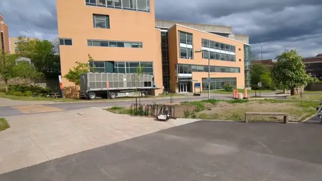
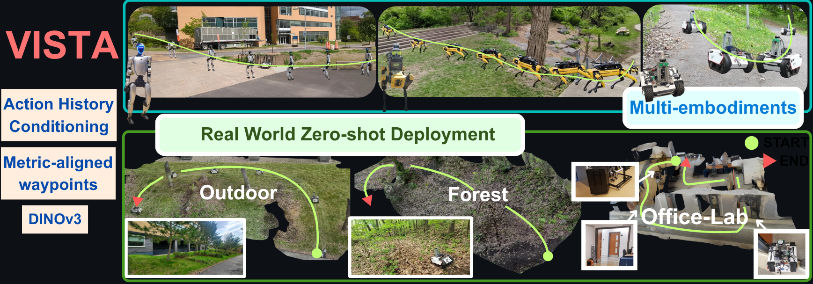
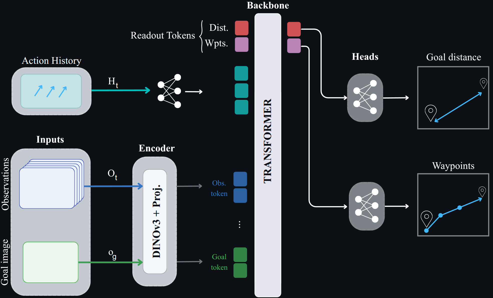

# VISTA: Scale-Aware Visual Navigation via Action History Conditioning

**[Maeva Guerrier](https://scholar.google.com/citations?hl=fr&user=4-GRCBsAAAAJ), Koki Kobayashi, [Simon Roy](https://scholar.google.ca/citations?user=Ltu98iQAAAAJ&hl=fr), [Jana Pavlasek](https://scholar.google.com/citations?hl=fr&user=yJS-u7IAAAAJ), [Giovanni Beltrame](https://scholar.google.com/citations?hl=fr&user=TVHJJ9wAAAAJ)**  
Polytechnique Montréal, MILA

---

# Overview

  

# VISTA Architecture

  

# Troubleshooting 